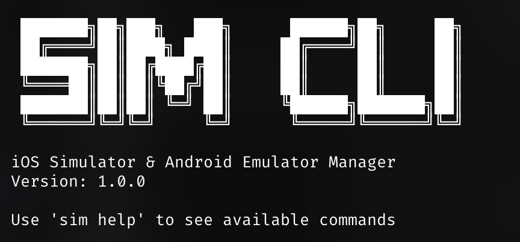

# SIM-CLI
[](https://github.com/annurdien/sim-cli/actions/workflows/ci.yml)

CLI tool to manage iOS simulators and Android emulators with ease.

<div align="center">
  
</div>


## Overview

SIM-CLI is a cross-platform command-line tool that provides a unified interface for managing iOS simulators and Android emulators. It simplifies common tasks like listing devices, starting/stopping simulators, taking screenshots, and recording screen activity.

## Features

- **Device Management**: List, start, stop, shutdown, restart, and delete simulators/emulators
- **Media Capture**: Take screenshots and record screen activity
- **Cross-Platform**: Works on macOS (with full iOS simulator support) and Linux/Windows (Android emulators only)
- **User-Friendly**: Clean, intuitive CLI interface with helpful error messages
- **Shorthand Commands**: Quick aliases for all commands (e.g., `l` for list, `s` for start)

## Installation

### Prerequisites

- **For iOS simulators**: macOS with Xcode installed
- **For Android emulators**: Android SDK with `adb` and `emulator` tools in PATH

### Build from Source

```bash
git clone https://github.com/annurdien/sim-cli.git
cd sim-cli
make build
```

### Install
```bash
make install
```

## Usage

### Quick Start

```bash
# List all devices (shorthand: sim l or sim ls)
sim list

# Start a device (shorthand: sim s "device")
sim start "iPhone 15 Pro"

# Take a screenshot (shorthand: sim ss "device")
sim screenshot "iPhone 15 Pro"

# Stop the device (shorthand: sim st "device") 
sim stop "iPhone 15 Pro"
```

### List Available Devices

```bash
sim list
```

Example output:
```
┌───────────────┬───────────────────────────────────────┬──────────┬──────────────────────────────────────┬──────────┐
│     TYPE      │                 NAME                  │  STATE   │                 UDID                 │ RUNTIME  │
├───────────────┼───────────────────────────────────────┼──────────┼──────────────────────────────────────┼──────────┤
│ iOS Simulator │ iPhone 15 Pro                         │ Shutdown │ AD3D3E8D-785C-4982-BADE-6D9A20D195A5 │ iOS 17.5 │
│ iOS Simulator │ iPhone 15 Pro Max                     │ Shutdown │ 9A3BAC90-B6A4-43B9-A6FF-40192D23F4D1 │ iOS 17.5 │
│ iOS Simulator │ iPhone 17.5                           │ Shutdown │ 28823504-3E61-427B-BB79-C8A845A501FC │ iOS 17.5 │
│ iOS Simulator │ iPhone 15 Plus                        │ Shutdown │ 323FE005-AF77-448B-AF0B-C4AC20DFBF6B │ iOS 17.5 │
└───────────────┴───────────────────────────────────────┴──────────┴──────────────────────────────────────┴──────────┘
```

### Start a Device

```bash
# Start by name
sim start "iPhone 15 Pro"

# Start by UDID
sim start A1B2C3D4-E5F6-G7H8-I9J0-K1L2M3N4O5P6

# Start last started device device
sim start lts
# OR
sim s lts
```

### Stop a Device

```bash
sim stop "iPhone 15 Pro"
```

### Restart a Device

```bash
sim restart "Pixel_7_API_34"
```

### Delete a Device

```bash
# Delete by name (⚠️ This permanently removes the device)
sim delete "iPhone 15 Pro"

# Delete by UDID
sim delete A1B2C3D4-E5F6-G7H8-I9J0-K1L2M3N4O5P6
```

**Warning**: The delete command permanently removes the simulator or emulator. Use with caution!

### Take a Screenshot

```bash
# Auto-generated filename
sim screenshot "iPhone 15 Pro"

# Custom filename
sim screenshot "iPhone 15 Pro" my_screenshot.png
```

### Record Screen

```bash
# Record until manually stopped (Ctrl+C)
sim record "iPhone 15 Pro"

# Record for specific duration (in seconds)
sim record "iPhone 15 Pro" --duration 30

# Custom filename
sim record "iPhone 15 Pro" my_recording.mp4 --duration 60
```

## Commands Reference

| Command | Aliases | Description |
|---------|---------|-------------|
| `list` | `l`, `ls` | List all available simulators and emulators |
| `start <device>` | `s` | Start a simulator or emulator |
| `stop <device>` | `st` | Stop a running simulator or emulator |
| `shutdown <device>` | `sd` | Shutdown a simulator or emulator |
| `restart <device>` | `r` | Restart a simulator or emulator |
| `delete <device>` | `d`, `del` | Delete a simulator or emulator (permanent) |
| `screenshot <device> [file]` | `ss`, `shot` | Take a screenshot |
| `record <device> [file]` | `rec` | Record screen activity |
| `help` | - | Show help information |
| `version` | - | Show version information |

### Shorthand Examples

```bash
# These commands are equivalent:
sim list # or sim l or sim ls
sim start "device" # or sim s "device"
sim stop "device"  # or sim st "device"
sim delete "device" # or sim d "device" or sim del "device"
sim screenshot "device" # or sim ss "device" or sim shot "device"
```

## Device Identification

Devices can be identified by:
- **Name**: Exact device name (e.g., "iPhone 15 Pro")
- **UDID**: Unique device identifier

Use `sim list` to see available devices and their identifiers.

## Safety & Best Practices

### Delete Command Safety
- The `delete` command permanently removes simulators/emulators
- Always verify the device name/UDID before deletion
- Consider using `sim list` first to confirm the exact device name
- Running devices are automatically stopped before deletion

### iOS Simulators
- Deleted simulators can be recreated through Xcode
- Custom simulator configurations will be lost

### Android Emulators  
- Deleted AVDs must be manually recreated
- All data and configurations will be permanently lost

## Platform Support

- **macOS**: Full support for iOS simulators and Android emulators
- **Linux/Windows**: Android emulator support only

## Contributing

1. Fork the repository
2. Create a feature branch
3. Make your changes
4. Test thoroughly
5. Submit a pull request

## License

MIT License - see LICENSE file for details.
