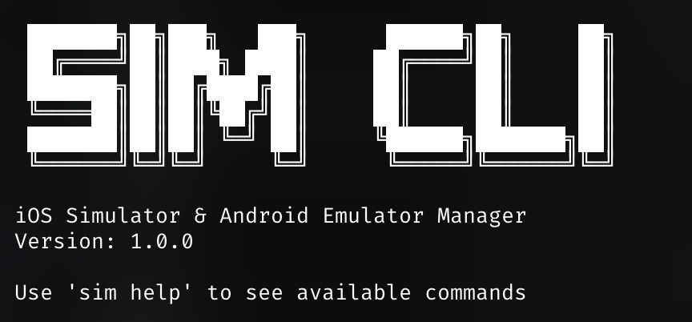

# SIM-CLI

[](https://github.com/annurdien/sim-cli/actions/workflows/ci.yml)
[](https://github.com/annurdien/sim-cli/actions/workflows/release.yml)
[](https://github.com/annurdien/sim-cli/releases)
[](https://golang.org)
[](https://opensource.org/licenses/MIT)

<div align="center">
  
  <p>
    <strong>iOS Simulator & Android Emulator Manager</strong>
  </p>
  <p>
    A powerful, cross-platform command-line tool to streamline your mobile development workflow.
  </p>
</div>

## Overview

SIM-CLI provides a simple and unified interface to manage your iOS simulators and Android emulators. Stop switching between GUIs and manage all your devices directly from the terminal.

## Features

- **Device Management**: List, start, stop, shutdown, restart, and delete simulators/emulators.
- **Factory Reset**: Quickly erase device data with the `erase` command.
- **Device Cloning**: Duplicate existing iOS simulators instantly.
- **App Management**: Install and uninstall `.apk`, `.app`, and `.ipa` files automatically to the correct device type.
- **Shell Autocompletion**: Tab completion for bash, zsh, fish, and powershell, including device names.
- **Deep Linking**: Instantly open any URL or deeplink on a running device.
- **Media Capture**: Take screenshots and record screen activity with ease.
- **Clipboard Integration**: Copy screenshots and recordings directly to your clipboard.
- **GIF Conversion**: Automatically convert screen recordings to GIFs (requires `ffmpeg`).
- **Dependency Check**: Built-in `doctor` command to verify all system dependencies.
- **Cross-Platform**: Works on macOS (full iOS + Android support) and Linux/Windows (Android emulators only).
- **Shorthand Commands**: Quick aliases for all commands (e.g., `l` for list, `s` for start).
- **Smart Device Selection**: Start the last used device with a single `sim lts` command.

## Installation

### Install via Homebrew (macOS/Linux)

The recommended way to install SIM-CLI is via Homebrew. This will also automatically install `ffmpeg`:

```bash
brew tap annurdien/tap
brew install sim-cli
```

Or as a one-liner:

```bash
brew install annurdien/tap/sim-cli
```

### Build from Source

```bash
git clone https://github.com/annurdien/sim-cli.git
cd sim-cli
make build
make install
```

### Prerequisites

| Dependency | Required for | Install |
|---|---|---|
| Xcode / Command Line Tools | iOS simulators | App Store / `xcode-select --install` |
| Android SDK (`adb`, `emulator`) | Android emulators | Android Studio |
| `ffmpeg` | GIF recording | `brew install ffmpeg` |

After installing, run `sim doctor` to verify your setup.

## Usage

### Quick Start

```bash
# 1. Verify all dependencies are in place
sim doctor

# 2. List all available devices
sim list

# 3. Start a device by name
sim start "iPhone 15 Pro"

# 4. Take a screenshot and copy it to the clipboard
sim screenshot "iPhone 15 Pro" --copy

# 5. Open a deeplink or URL (auto-selects first booted device)
sim open "myapp://home"

# 6. Record a 10-second GIF
sim record "iPhone 15 Pro" --duration 10 --gif

# 7. Install an app (auto-selects device based on extension)
sim install app-release.apk

# 8. Factory reset a device
sim erase "iPhone 15 Pro"

# 9. Stop the device
sim stop "iPhone 15 Pro"
```

### Shell Autocompletion

To enable tab completion for your shell (which auto-completes device names and commands), run:

```bash
# Zsh
sim completion zsh > ~/.zshrc_sim_completion
source ~/.zshrc_sim_completion

# Bash
sim completion bash > /etc/bash_completion.d/sim

# Fish
sim completion fish > ~/.config/fish/completions/sim.fish
```

### Smart Device Shortcuts

```bash
# Start the last device you used
sim lts

# See which device was last used
sim last
```

## Commands Reference

| Command | Aliases | Description |
|---|---|---|
| `doctor` | - | Check all system dependencies (Xcode, Android SDK, ffmpeg). |
| `list` | `l`, `ls` | List all available simulators and emulators. |
| `start <device>` | `s` | Start a simulator or emulator by name or UDID. |
| `stop <device>` | `st` | Stop a running simulator or emulator. |
| `shutdown <device>` | `sd` | Shutdown a simulator or emulator. |
| `restart <device>` | `r` | Restart a simulator or emulator. |
| `delete <device>` | `d`, `del` | **Permanently** delete a simulator or emulator. |
| `erase <device>` | `reset` | Factory reset a device, wiping its data. |
| `clone <source> <new>`| - | Clone an iOS simulator to a new instance. |
| `install [dev] <app>`| `i` | Install an app on a device (`.apk`, `.app`, `.ipa`). |
| `uninstall [dev] <id>`| `u`, `remove`| Uninstall an app from a device by ID or package name. |
| `open [device] <url>` | `o` | Open a deeplink or URL. Device is optional — defaults to the first booted device. |
| `screenshot <device> [file]` | `ss`, `shot` | Take a screenshot of a device. |
| `record <device> [file]` | `rec` | Record the screen of a device. |
| `logs [device]` | `log` | Stream real-time logs from a device. |
| `push [dev] <id> <file>`| - | Send a push notification (iOS only). |
| `create` | - | Create a new iOS simulator or Android emulator. |
| `status` | - | Show a compact dashboard of only running devices. |
| `copy to/from` | - | Transfer files to or from a device. |
| `pair [watch] [phone]` | - | Pair an Apple Watch simulator with an iPhone simulator. |
| `config` | - | Manage sim-cli configuration values. |
| `last` | - | Show the last used device. |
| `lts` | - | Start the last used device (short for `sim start lts`). |
| `completion <shell>` | - | Generate shell autocompletion script. |
| `version` | `-v` | Show the current version. |
| `help` | - | Show help information. |

## Interactive Mode (TUI)

If you run any command that expects a device argument (like `start`, `stop`, `shutdown`, `restart`, `delete`, `erase`, `logs`, or `pair`) without passing a device name or UDID, `sim-cli` will launch a beautiful interactive Text User Interface (TUI) menu to let you select the target device.

### screenshot Options

| Flag | Shorthand | Description |
|---|---|---|
| `--copy` | `-c` | Copy the screenshot to the clipboard after saving. |

### record Options

| Flag | Shorthand | Description |
|---|---|---|
| `--duration` | `-d` | Duration of the recording in seconds (e.g., `--duration 15`). |
| `--gif` | `-g` | Convert the recording to a GIF after it completes. |
| `--copy` | `-c` | Copy the output file path to the clipboard. |

### open Options

The `open` command accepts any valid URL or custom URI scheme. The device argument is optional:

```bash
# Auto-select the first booted device
sim open "myapp://settings"
sim o "https://example.com"

# Target a specific device
sim open "iPhone 15 Pro" "myapp://settings"
sim open "Pixel_7_API_34" "https://example.com"
```

### logs Options

| Flag | Shorthand | Description |
|---|---|---|
| `--level` | `-l` | Filter logs by level (`debug`, `info`, `warn`, `error`). |
| `--filter` | `-f` | Filter logs in real-time with a grep pattern. |
| `--app` | `-a` | Filter logs by app bundle ID (iOS) or package name (Android). |

### push Options

| Flag | Shorthand | Description |
|---|---|---|
| `--template` | `-t` | Generate a sample push payload template (`push.json`) in the current directory. |

### create Options

| Flag | Shorthand | Description |
|---|---|---|
| `--ios` / `--android` | - | Specify the target platform (required). |
| `--name` | `-n` | The name for the new device. |
| `--type` | `-t` | The hardware device type (e.g., `iPhone-15`, `pixel_7`). |
| `--runtime` | `-r` | The OS runtime/system image (e.g., `iOS-17-0`). |
| `--list-types` | - | Display all available hardware types and OS runtimes for the platform instead of creating a device. |

### copy Usage

```bash
# Copy a local file to the device (iOS: Photos app, Android: /sdcard/Download)
sim copy to "iPhone 15 Pro" ~/Pictures/test.png

# Copy a remote file from an Android device to your local machine
sim copy from "Pixel_7" /sdcard/Download/test.png ./
```

## Configuration

SIM-CLI stores its runtime state (e.g., last used device) and user preferences in a JSON file at:

```
~/.sim-cli/config.json
```

You can view and modify these settings using the `config` command:

```bash
# View all configuration settings
sim config show

# Set the default directory for saving screenshots and recordings
sim config set outputDir ~/Desktop/captures

# Configure GIF recording settings
sim config set gifFps 15
sim config set gifScale 320
```

Supported configuration keys: `defaultDevice`, `outputDir`, `gifFps`, `gifScale`.

The project-level `config.yaml` in the repository root defines the release version and metadata used by the build system and CI/CD pipeline:

```yaml
app:
  name: "sim-cli"
  version: "1.7.0"
  description: "CLI tool to manage iOS simulators and Android emulators"
```

To release a new version, bump `version` in `config.yaml` and push with `release:` in the commit message.

## Safety & Best Practices

### Delete and Erase Commands

The `delete` command is destructive and **permanently removes** the simulator or emulator.
The `erase` command acts as a factory reset and wipes all user data on the device.

- Always double-check the device name or UDID with `sim list` before deleting or erasing.
- You can bypass the interactive confirmation prompt by passing the `--force` or `-f` flag.
- Deleted simulators must be recreated through Xcode (for iOS) or the AVD Manager (for Android).

## Contributing

Contributions are welcome! Please feel free to submit a pull request.

1. Fork the repository.
2. Create your feature branch (`git checkout -b feature/AmazingFeature`).
3. Commit your changes (`git commit -m 'Add some AmazingFeature'`).
4. Push to the branch (`git push origin feature/AmazingFeature`).
5. Open a pull request.

## License

This project is licensed under the MIT License - see the [LICENSE](LICENSE) file for details.
