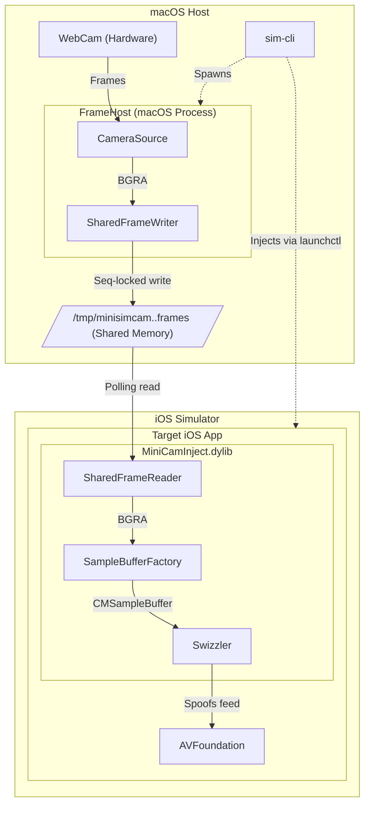
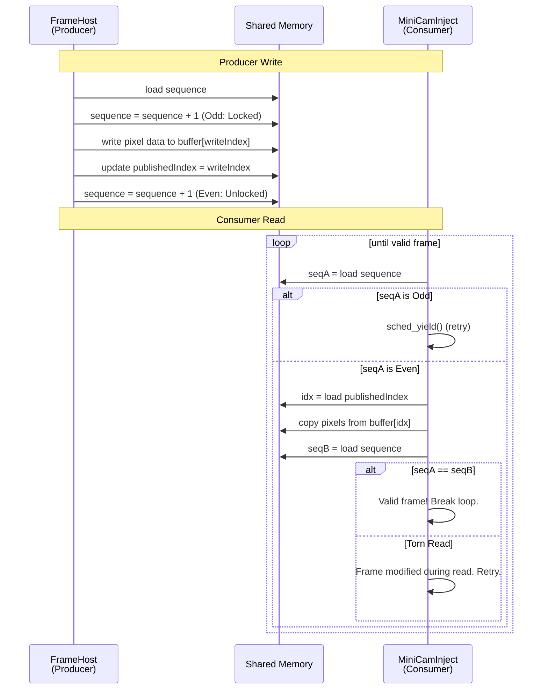
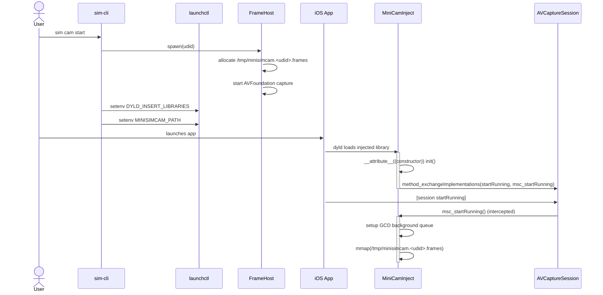
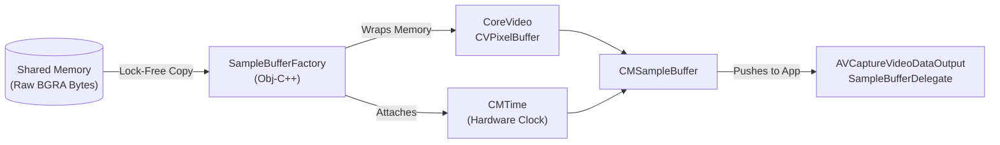
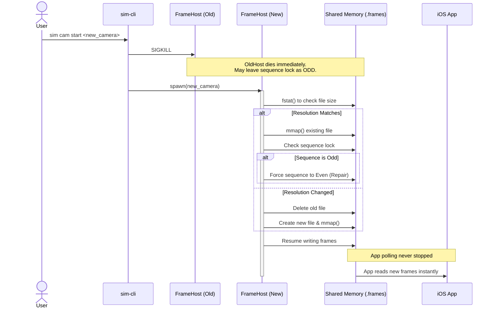

# SIM-CLI Camera Architecture

This document explains the technical architecture of the `sim cam` feature. It details how `sim-cli` injects macOS cameras into iOS Simulator apps, a capability Apple does not natively support.

## The Problem
The iOS Simulator lacks hardware passthrough for the host Mac's physical cameras. When an app running in the simulator uses `AVFoundation` to request camera access, the simulator returns a mock black screen, provides a static placeholder, or crashes the app.

## The Solution
`sim-cli` solves this using a distributed, two-process architecture communicating over lock-free shared memory. 



---

## 1. Inter-Process Communication (IPC)

Passing uncompressed 1080p or 4K video at 60 frames per second between two separate processes requires moving up to 500 MB/s of data.

**The Design Decision:**
Standard IPC mechanisms like XPC, Mach ports, or local UNIX sockets require serializing the data, copying it into the operating system kernel space, and then copying it back out to the receiving process. This double-copy creates CPU bottlenecks and latency. To fix this, `sim-cli` uses **Memory-Mapped Files (`mmap`)**.

Memory mapping maps a file directly into the virtual memory space of both the macOS `FrameHost` process and the iOS Simulator app process. When `FrameHost` writes a pixel to this memory region, the iOS app can read that exact byte instantly. This enables zero-copy data transfer.

### Memory Layout
The shared memory file consists of a 128-byte header (`MSCStreamHeader`), immediately followed by a triple-buffer of raw BGRA pixel data.

```c
typedef struct {
    uint32_t magic;                // "MSCC"
    uint32_t version;              // Version schema
    uint32_t width;                // Frame width
    uint32_t height;               // Frame height
    uint32_t bytesPerRow;          // Memory stride (aligned to 64 bytes)
    uint32_t pixelFormat;          // 'BGRA'
    uint32_t bufferCount;          // 3 (Triple buffered)
    uint32_t bufferSize;           // bytesPerRow * height
    uint64_t sequence;             // ATOMIC: Sequence lock for writers
    uint32_t publishedIndex;       // ATOMIC: Current readable buffer index
    uint32_t _pad0;                // Alignment padding
    uint64_t presentationTimeNs;   // Frame PTS (Nanoseconds)
    uint64_t framesProduced;       // ATOMIC: Total frames produced
    uint8_t  reserved[64];         // Future expansion padding
} MSCStreamHeader;                 // Exactly 128 bytes
```

### The Lock-Free Algorithm
Because the producer (`FrameHost`) and consumer (`MiniCamInject`) run in separate processes, they need a way to coordinate. If `FrameHost` writes data while the app is reading it, the video frame tears (the top half of the old frame mixed with the bottom half of the new frame).

**The Design Decision:**
We cannot use standard POSIX mutexes (`pthread_mutex_t`). If the user stops the camera and `sim-cli` kills `FrameHost` via `SIGKILL` while it holds a shared mutex, the mutex is permanently locked. The iOS app would wait on that lock forever and freeze. 

Instead, `sim-cli` uses a **Sequence Lock** (SeqLock) implementation with C++20 standard atomic memory orders (`std::memory_order_acquire` / `std::memory_order_release`). Sequence locks eliminate deadlocks because the reader never blocks. It only retries.



1. **Producer writes:** `FrameHost` extracts raw BGRA pointers from the Mac's hardware camera. It atomically increments the `sequence` integer to an **odd** number, signaling a write is in progress. It copies the frame into an inactive buffer slot, updates `publishedIndex`, and increments `sequence` to an **even** number.
2. **Consumer reads:** `MiniCamInject` polls the `sequence` integer. If it is even, it begins reading the frame from `publishedIndex`. After the memory copy finishes, it checks `sequence` again. If `sequence` changed during the read, a torn read occurred. The consumer discards the bad frame and retries instantly.

---

## 2. Initialization and Injection

To force the iOS app to read from our custom camera feed instead of the simulator's hardware abstraction, the system uses dynamic library injection.

**The Design Decision:**
We could patch the source code of the iOS app, but that requires modifying user code and re-compiling, which slows down development. By injecting a dynamic library (`.dylib`) at runtime, the developer does not need to change a single line of their application code.



### Global Injection Mechanics
When you start a camera via `sim-cli cam start`, the CLI executes `xcrun simctl spawn <udid> launchctl setenv`. This modifies the global environment of the booted iOS Simulator. 
- `DYLD_INSERT_LIBRARIES=/path/to/MiniCamInject.dylib`: Forces the Apple dynamic linker (`dyld`) to load our library into every app launched on the simulator before the app's `main()` function executes.
- `MINISIMCAM_PATH`: Passes the path of the shared memory file so the dylib knows where to read frames.

Because this is set globally via `launchctl`, *any* app launched on the simulator automatically receives the injection.

### Objective-C Method Swizzling
Objective-C allows developers to change the mapping between a method name (selector) and its underlying C function (implementation) at runtime. This technique is known as Method Swizzling.

Inside `MiniCamInject.dylib`, a C constructor function (`__attribute__((constructor))`) runs immediately upon load. It uses the Objective-C runtime function `method_exchangeImplementations` to swap the memory addresses of Apple's internal `AVCaptureSession` methods with our custom implementations.

When the iOS app calls `[session startRunning]`, execution jumps to our code. The code bypasses Apple's hardware initialization, creates a Grand Central Dispatch (GCD) background thread, and begins reading frames from the shared memory.

---

## 3. Frame Delivery

When the iOS app's GCD queue successfully copies an un-torn frame from shared memory, it must convert the raw data into a format `AVFoundation` understands.



1. `SampleBufferFactory` (written in Objective-C++) takes the raw BGRA memory array.
2. It wraps the memory into a CoreVideo `CVPixelBuffer`.
3. It attaches hardware timing data (`CMTime`) to match the simulator's internal clock.
4. It packages the `CVPixelBuffer` into a `CMSampleBuffer`.
5. It pushes the `CMSampleBuffer` to the `AVCaptureVideoDataOutputSampleBufferDelegate` of the app.

The host app receives the delegate callbacks exactly as it would from a hardware camera.

---

## 4. Camera Switching Logic
`sim-cli` supports hot-swapping cameras without crashing or restarting the iOS app.



When the active camera is changed:
1. `sim-cli` sends a termination signal (SIGKILL) to the running `FrameHost` daemon.
2. `sim-cli` spins up a new `FrameHost` daemon for the new camera.
3. The shared memory `.frames` file on disk is kept intact unless the requested resolution changes.
4. The new `FrameHost` uses `fstat` to verify the file size. If it matches, it memory maps the existing file instead of recreating it.
5. If the previous `FrameHost` was killed mid-write (leaving `sequence` as an odd number), the new `FrameHost` detects this and forces the atomic `sequence` back to an even number to repair the lock state.
6. The iOS app, which is polling the memory map continuously, sees the `sequence` advance and resumes rendering new frames.
