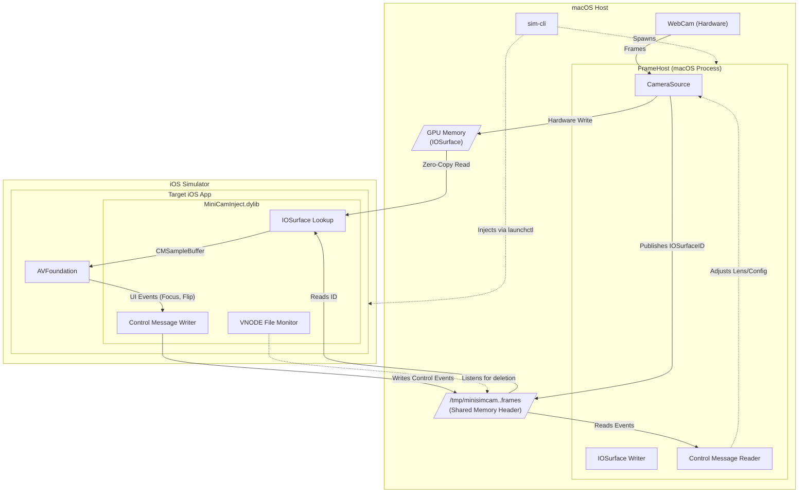
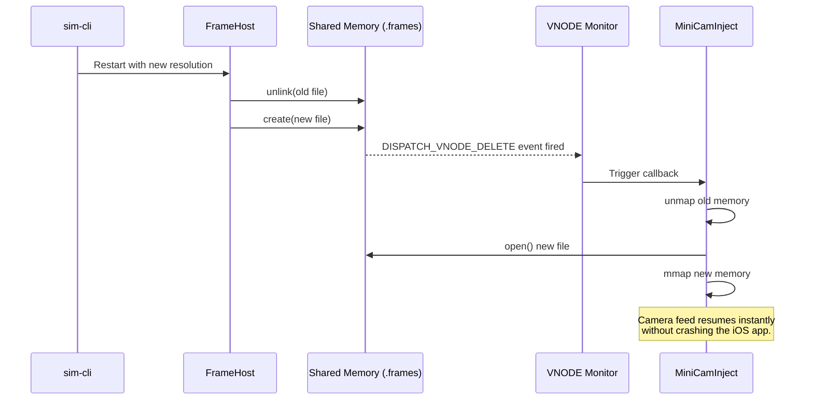

# SIM-CLI Camera Architecture

This document explains the technical architecture of the `sim cam` feature. It details how `sim-cli` injects macOS cameras into iOS Simulator apps, a capability Apple does not natively support.

## The Problem
The iOS Simulator lacks hardware passthrough for the host Mac's physical cameras. When an app running in the simulator uses `AVFoundation` to request camera access, the simulator returns a mock black screen, provides a static placeholder, or crashes the app.

## The Solution
`sim-cli` solves this using a distributed, two-process architecture communicating over lock-free shared memory and GPU-backed `IOSurface` references.



---

## 1. Zero-Copy `IOSurface` Delivery (Hardware Acceleration)

Passing uncompressed 1080p or 4K video at 60 frames per second between two separate processes requires moving up to 500 MB/s of data.

Standard IPC mechanisms like XPC, Mach ports, or local UNIX sockets serialize the data and copy it through the kernel, creating CPU bottlenecks and latency. Earlier versions of `sim-cli` used POSIX shared memory (`mmap`) for pixel data, which still required CPU `memcpy` operations.

**The Design Decision:**
`sim-cli` now uses **`IOSurface`** for true zero-copy, hardware-accelerated memory sharing. `IOSurface` is Apple’s native framework for sharing GPU memory across process boundaries.

1. **Producer writes:** `FrameHost` extracts frames from the Mac's hardware camera and writes them directly to an `IOSurface` on the GPU.
2. **Synchronization:** `FrameHost` writes the resulting 32-bit `IOSurfaceID` into a tiny 128-byte shared memory file (`mmap`).
3. **Consumer reads:** `MiniCamInject` inside the iOS Simulator app reads the `IOSurfaceID`, calls `IOSurfaceLookup()`, and wraps it directly into a CoreVideo `CVPixelBuffer`. The CPU never touches the pixel bytes.

### Shared Memory Layout
The shared memory file now serves exclusively as a synchronization and control plane. It consists of a 128-byte header (`MSCStreamHeader`) and a control event ring buffer.

```c
typedef struct {
    uint32_t magic;                // "MSCC"
    uint32_t version;              // Version schema
    uint32_t width;                // Frame width
    uint32_t height;               // Frame height
    uint32_t bytesPerRow;          // Memory stride (aligned to 64 bytes)
    uint32_t pixelFormat;          // 'BGRA'
    uint32_t bufferCount;          // Deprecated in favor of IOSurface
    uint32_t ioSurfaceID;          // ID for IOSurfaceLookup
    uint64_t sequence;             // ATOMIC: Sequence lock for writers
    uint32_t publishedIndex;       // ATOMIC: Current readable buffer index
    uint32_t controlHead;          // ATOMIC: Head index for control ring buffer
    uint32_t controlTail;          // ATOMIC: Tail index for control ring buffer
    uint64_t presentationTimeNs;   // Frame PTS (Nanoseconds)
    uint64_t framesProduced;       // ATOMIC: Total frames produced
} MSCStreamHeader;                 // Exactly 128 bytes
```

### The Lock-Free Algorithm
To coordinate the shared memory updates without standard POSIX mutexes (which can deadlock if a process dies), `sim-cli` uses a **Sequence Lock** (SeqLock) implementation with C++20 standard atomic memory orders (`std::memory_order_acquire` / `std::memory_order_release`). Sequence locks eliminate deadlocks because the reader never blocks. It only retries.

---

## 2. Initialization and Injection

To force the iOS app to read from our custom camera feed instead of the simulator's hardware abstraction, the system uses dynamic library injection.

By injecting a dynamic library (`.dylib`) at runtime, the developer does not need to change a single line of their application code.

### Global Injection Mechanics
When you start a camera via `sim-cli cam start`, the CLI executes `xcrun simctl spawn <udid> launchctl setenv`. This modifies the global environment of the booted iOS Simulator. 
- `DYLD_INSERT_LIBRARIES=/path/to/MiniCamInject.dylib`: Forces the Apple dynamic linker (`dyld`) to load our library into every app launched on the simulator.
- `MINISIMCAM_PATH`: Passes the path of the shared memory file so the dylib knows where to read frames.

### Objective-C Method Swizzling
Inside `MiniCamInject.dylib`, a C constructor function (`__attribute__((constructor))`) runs immediately upon load. It uses the Objective-C runtime function `method_exchangeImplementations` to swap the memory addresses of Apple's internal `AVCaptureSession` methods with our custom implementations.

When the iOS app calls `[session startRunning]`, execution jumps to our code. The code bypasses Apple's hardware initialization, creates a Grand Central Dispatch (GCD) background thread, and begins reading frames from the shared memory.

---

## 3. Seamless Hot-Swapping (VNODE Monitor)

`sim-cli` supports hot-swapping cameras and changing resolutions without crashing or restarting the iOS app.

**The Design Decision:**
When a resolution changes, the macOS `FrameHost` must delete the old shared memory file and create a new one. To ensure the iOS app detects this instantly and remaps the memory, `MiniCamInject` uses a `DISPATCH_SOURCE_TYPE_VNODE` monitor.



The iOS app listens for `NOTE_DELETE` or `NOTE_RENAME` events on the shared memory file. If `sim-cli` deletes the file, the app detects it instantly, closes the old memory map, and `mmap`s the new file on the fly—making camera swapping perfectly seamless.

---

## 4. Bidirectional Control Channel

Camera injection is fully interactive. Data flows both ways: video frames flow from macOS to iOS, and control events flow from iOS back to macOS.

**The Design Decision:**
A lock-free **Control Ring-Buffer** sits immediately after the header in the shared memory file. It allows the iOS app to send camera control events back to macOS in real-time.

1. **User Interaction**: The user taps the "Flip Camera" button or taps to focus inside the iOS Simulator.
2. **Event Capture**: `MiniCamInject` (via swizzled `AVCaptureDevice` methods) intercepts these calls and writes an `MSCControlEvent` to the ring buffer.
3. **Hardware Dispatch**: The macOS `FrameHost` polls this buffer, reads the event, and physically adjusts the Mac's hardware camera (e.g., swapping from the FaceTime camera to a plugged-in DSLR, or adjusting hardware focus).

This bidirectional communication makes the injected camera feel native to the simulator.
